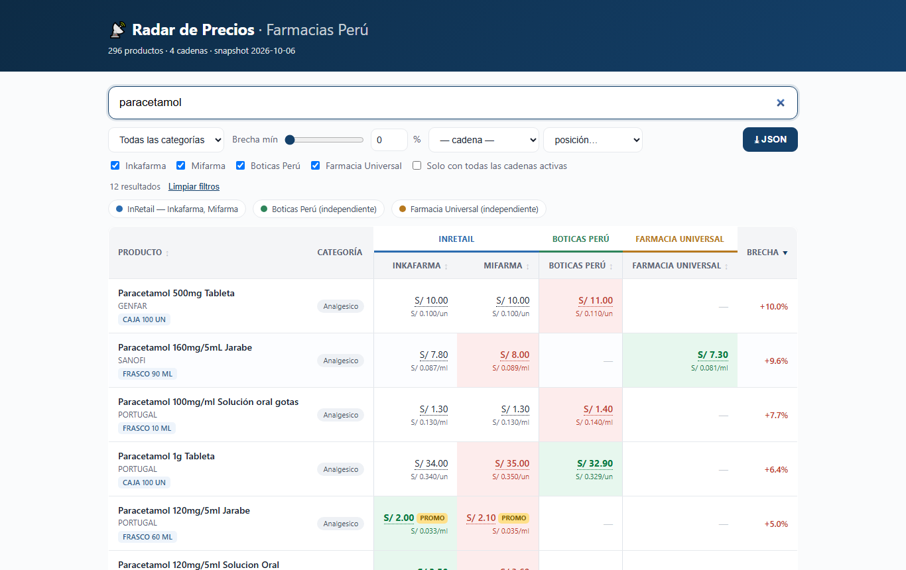
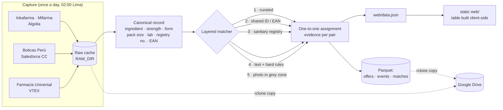
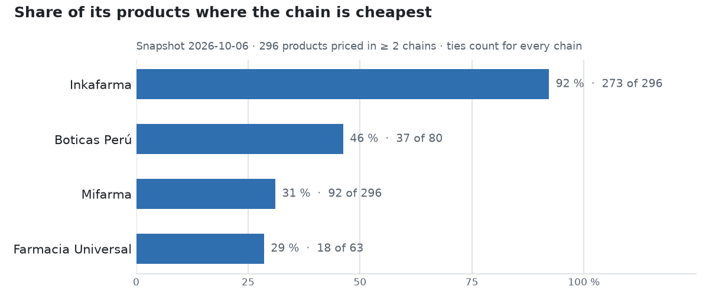

# Pharmacy Price Radar · Peru

[Español](README.md) · **English**


Compares the price of the **same medicine** across four Peruvian pharmacy chains. Reading prices
is the easy part. The real work is deciding, with no shared catalog, that two differently named
listings are the same product, and showing a blank rather than a wrong match.

**Demo:** [ichisieben.dev/radar-precios](https://ichisieben.dev/radar-precios/) (the live UI is
in Spanish; the bilingual v2 is in review, see *Limits*)



## How it works



- **Polite capture.** Only the public catalog endpoints each storefront calls from the browser.
  One request at a time, 2–6 s between requests to the same domain, exponential back-off on
  429/503 for searches, never a login or a cart.
- **Cache first, parse second.** Every response is stored raw. Reprocessing a run never touches
  the network and yields the same `data.json`, byte for byte.
- **A matcher in layers of rising cost**, each with hard vetoes: active ingredient, strength,
  pack size, paediatric vs adult, manufacturer, and a > 3× price guard. The full write-up is in
  [`docs/MATCHING.md`](docs/MATCHING.md) (Spanish).
- **No-build front end.** Plain HTML/CSS/JS reads `data.json` and builds the table in the
  browser. All paths are relative, so it works under `/radar-precios/` or at the root. Running
  cost: zero.

## Run it

Tested on Windows 10 with Python 3.12 (`core/` stays 3.9-compatible). On a Windows console,
`PYTHONIOENCODING=utf-8` is required.

```bash
py -m pip install -r requirements.txt
py -m pip install playwright matplotlib     # only for the web smoke test and the chart
py -m playwright install chromium

# Open the demo with the bundled data (no network, no keys)
py -m http.server -d web 8000                  # http://localhost:8000  ·  ?demo=1 fakes ▲▼ and promos

# Tests (offline)
PYTHONIOENCODING=utf-8 py -m tests.test_matcher_regresion   # 85/85 curated pairs
PYTHONIOENCODING=utf-8 py -m tests.test_http_cache
PYTHONIOENCODING=utf-8 py -m tests.test_credencial
PYTHONIOENCODING=utf-8 py -m tests.test_publish
PYTHONIOENCODING=utf-8 py -m tests.test_sincronizar           # needs rclone installed
PYTHONIOENCODING=utf-8 py -m tests.test_web_smoke           # demo under a subfolder, Playwright
```

Capturing live prices needs a `.env` (copy `.env.example`) with the **public, search-only**
Algolia keys Inkafarma and Mifarma ship in their own JavaScript. They are not secrets, but they
rotate: on a 403, copy them again from DevTools → Network → `*.algolia.net`.

```bash
PYTHONIOENCODING=utf-8 py -m pipeline.run --todo                     # capture + process + export (~1 h)
PYTHONIOENCODING=utf-8 py -m pipeline.run --desde-cache <run-id>      # reprocess, no network
PYTHONIOENCODING=utf-8 py -m tests.verificar_desde_cache <run-id>     # no network, byte-identical
```

I did not rerun the full capture for this README; its figures come from the log of the
2026-10-06 nightly run (below). The cache replay was run on 2026-10-07: 12 s, zero network
requests, byte-identical output.

## What it produces (run of 2026-10-06)

| Measure | Value |
|---|---|
| Products priced in ≥ 2 chains | **296** |
| … priced in all 4 chains | **37** |
| … with a Boticas Perú / Farmacia Universal price | 80 / 63 |
| Boticas/Universal matches by method | 47 EAN · 19 sanitary registry · 69 text · 6 curated · 2 photo |
| Requests in the run · errors | 1,354 · 0 |
| Duration | 58 min (3,464 s) |
| Median gap between the dearest and cheapest chain | 3.1 % |
| Products with a gap ≥ 20 % | 25 |



Read the chart with care: the basket is seeded from Inkafarma's catalog, so Inkafarma has a
price for every product and the other chains only where a match was found. It describes this
basket; it is not a ranking of chains.

## Limits

- **A basket, not a catalog.** 296 products picked by search terms and subcategories, not each
  chain's full range. Full-category coverage is phase F2 of [`V2_PLAN.md`](V2_PLAN.md) and sits
  on an unmerged branch.
- **A "—" does not mean the chain doesn't sell it.** It means the matcher found no equivalent
  with enough evidence. That is by design: a false positive costs more than a gap.
- **Online prices, not in-store,** as of capture time (02:00, Lima).
- **Medicines, supplements and dermocosmetics only.** Cosmetics and personal care are out: with
  no active ingredient there is no reliable way to tell near-identical SKUs apart.
- **The new UI (v2) is in review.** Astro, bilingual, with per-product price history, a market
  overview and a methodology page: [PR #4](https://github.com/IchiSieben/farmacias/pull/4). The
  published demo is the Spanish-only v1 on this branch.
- **Not an official source.** Peru's official medicine-price reference is DIGEMID's
  Observatorio Peruano de Productos Farmacéuticos.

## Data, trademarks and licences

- **Code:** Apache 2.0 ([`LICENSE`](LICENSE)).
- **Prices:** public facts read from each chain's online store; they belong to the chains. This
  is an independent comparison exercise with **no affiliation** to Inkafarma, Mifarma, Boticas
  Perú or Farmacia Universal. Trademarks belong to their owners.
- **Dependencies:** httpx (BSD-3), PyYAML (MIT), rapidfuzz (MIT), selectolax (MIT),
  ImageHash (BSD-2), Pillow (MIT-CMU), pyarrow (Apache 2.0).

## More documentation (Spanish)

[`docs/MATCHING.md`](docs/MATCHING.md) how a match is decided ·
[`docs/ESQUEMA_DATOS.md`](docs/ESQUEMA_DATOS.md) raw, Parquet and JSON schemas ·
[`docs/ESTUDIO.md`](docs/ESTUDIO.md) concepts the project teaches ·
[`V2_PLAN.md`](V2_PLAN.md) current plan · [`ROADMAP.md`](ROADMAP.md) what's left, with dates ·
[`SECURITY.md`](SECURITY.md) how to report an issue (bilingual).

## How to cite

See [`CITATION.cff`](CITATION.cff) (GitHub shows a **Cite this repository** button).

Yoichi Palacios Tanaka (IchiSieben) · [ichisieben.dev](https://ichisieben.dev)
