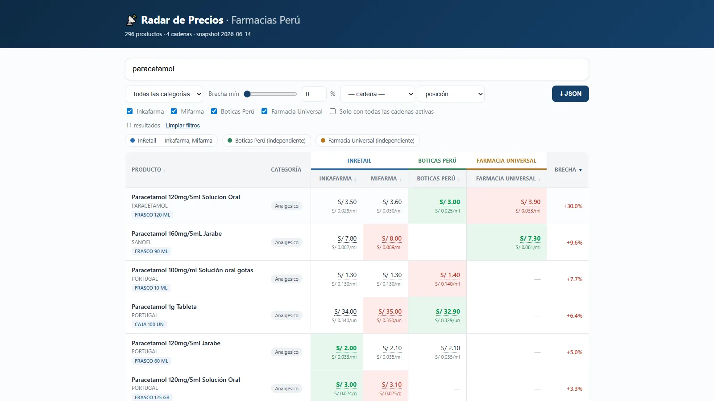

# Radar de Precios — Peru Pharmacy Price Comparator


Compare medicine prices across four Peruvian pharmacy chains — a price checker for the
same box of paracetamol in four stores at once.

**Live demo:** [ichisieben.dev/radar-precios](https://ichisieben.dev/radar-precios/)



## Why it exists

The same product, from the same lab, routinely differs 20-70% in price between chains —
and two of the four chains belong to the same holding. This project makes that spread
visible: it collects prices on a schedule, matches products across chains, and renders a
static comparison page anyone can read.

## How it works

```
adapters (one per chain)  →  snapshots (JSONL)  →  matcher  →  static HTML
```

- **One adapter per chain**, each speaking the chain's own storefront protocol:
  - Inkafarma and Mifarma run on their holding's Algolia search (same document
    schema, separate instances). The adapters use the public client-side search
    keys each storefront ships in its own JS bundle.
  - Boticas Perú runs on Salesforce Commerce Cloud; its adapter combines the
    HTML product grid with the storefront's clean QuickView JSON.
  - Farmacia Universal runs on VTEX; its adapter reads the storefront's public
    search API.
- **A three-layer matcher** decides when two listings are the same product:
  1. Exact ID — Inkafarma and Mifarma share an internal product ID, so those
     match 1:1 for free.
  2. Fuzzy — name plus active ingredient and pack size, for chains that share
     nothing (with hard guards against bundles, variants and near-miss
     vitamins).
  3. Image verification — perceptual hashing of product photos to confirm
     doubtful fuzzy matches.
- **Snapshots are kept per run**, so the site can show price history and
  detect promotions by diffing runs, not by trusting promo labels.
- The comparator covers **medicines, supplements and dermo** — categories where
  matching by active ingredient + concentration + presentation is reliable. It
  deliberately excludes cosmetics/personal care, where there's no active
  ingredient to disambiguate near-identical products across brands.

## Running it

Verified on Windows, Python 3.12.

```bash
py -m pip install -r requirements.txt
cp .env.example .env   # then fill in the Algolia search credentials
py -m core.adapters.inkafarma buscar paracetamol
py -m pipeline.build_snapshot --objetivo 150 --salida web/data.json
```

The credentials in `.env` are the public search-only keys each chain embeds in
its own website (visible in DevTools → Network → requests to `*.algolia.net`).
They are not private secrets, but they rotate occasionally and don't belong in
a repo; when search starts returning 403, re-capture and update your `.env`.

### The static demo

`web/` is the published artifact: plain HTML, CSS and JS with no build step. It loads
`data.json` (or `data.demo.json` with `?demo`) at runtime and renders the comparison table
client-side, so it costs nothing to host.

```bash
cd web
py -m http.server 8000
# open http://localhost:8000 — confirmed: 200 on index.html, data.json and app.js
```

It opens with a five-step tutorial (`web/tutorial/`, vendored from `shared/tutorial/` in the
portfolio workspace) that a returning visitor never sees again — dismissal persists in
localStorage.

Every path in `web/` is relative, so the folder drops into any subdirectory unchanged.
Confirmed live at `/radar-precios/`.

## Data sources and licences

Prices are read from each chain's own public, search-only storefront endpoints — not an
official or documented API of any chain. Scope, throttling and rate limits are documented
in `SPEC_comparador_farmacias.md` and `recon/README_devtools.md`. Prices belong to their
respective chains (Inkafarma, Mifarma, Boticas Perú, Farmacia Universal); this project is
an independent comparison exercise and is not affiliated with any of them.

## Status

**Live** and **usable**: deployed at `/radar-precios/`, 296 products matched across
chains (64 matched in all three comparable chains). Pending: automating the currently
manual snapshot run, and surfacing price history from the snapshots already kept per run.

## Tests

`tests/test_matcher_regresion.py` pins the matcher against a curated basket of
known-good and known-bad pairs — the guard that keeps "Vitamina C 500mg x100"
from matching "Vitamina C gomitas x60". It's a standalone script, not pytest:

```bash
PYTHONIOENCODING=utf-8 py -m tests.test_matcher_regresion
# REGRESIÓN LIMPIA: 32/32 casos OK
```

(`PYTHONIOENCODING=utf-8` is needed on Windows — the default `cp1252` console
encoding can't print some accented characters in the output table.)

## Author

Yoichi Palacios Tanaka (IchiSieben) · [ichisieben.dev](https://ichisieben.dev)

## License

[Apache License 2.0](LICENSE).

---

*Internal working notes (SPEC, matching annex, roadmap) are in Spanish in the
repo root and `docs/`.*

---

# Español

## Radar de Precios — comparador de precios de farmacias en Perú

Compara precios de medicamentos entre cuatro cadenas de farmacias peruanas — un
verificador de precios para la misma caja de paracetamol en cuatro tiendas a la vez.

**Demo en vivo:** [ichisieben.dev/radar-precios](https://ichisieben.dev/radar-precios/)


### Por qué existe

El mismo producto, del mismo laboratorio, suele variar 20-70% de precio entre cadenas —
y dos de las cuatro cadenas pertenecen al mismo holding. Este proyecto hace visible esa
brecha: recolecta precios por corrida, empareja productos entre cadenas y renderiza una
página estática de comparación que cualquiera puede leer.

### Cómo funciona

```
adaptadores (uno por cadena)  →  snapshots (JSONL)  →  matcher  →  HTML estático
```

- **Un adaptador por cadena**, cada uno hablando el protocolo propio de la tienda:
  - Inkafarma y Mifarma corren sobre el Algolia del holding (mismo esquema de
    documento, instancias separadas). Los adaptadores usan las llaves públicas
    de búsqueda del lado cliente que cada tienda embebe en su propio bundle JS.
  - Boticas Perú corre sobre Salesforce Commerce Cloud; su adaptador combina la
    grilla HTML de producto con el JSON limpio de QuickView de la tienda.
  - Farmacia Universal corre sobre VTEX; su adaptador lee la API de búsqueda
    pública de la tienda.
- **Un matcher de tres capas** decide cuándo dos listados son el mismo producto:
  1. ID exacto — Inkafarma y Mifarma comparten un ID interno de producto, así
     que esos cruzan 1:1 gratis.
  2. Difuso (fuzzy) — nombre más principio activo y presentación, para cadenas
     que no comparten nada (con guardas duras contra combos, variantes y
     vitaminas casi idénticas).
  3. Verificación de imagen — hash perceptual de las fotos de producto para
     confirmar cruces difusos dudosos.
- **Se guarda un snapshot por corrida**, así que el sitio puede mostrar
  historial de precios y detectar promociones comparando corridas, no
  confiando en las etiquetas de promo.
- El comparador cubre **medicamentos, suplementos y dermo** — categorías donde
  emparejar por principio activo + concentración + presentación es confiable.
  Excluye deliberadamente cosmética/cuidado personal, donde no hay principio
  activo que distinga productos casi idénticos entre marcas.

### Cómo correrlo

Verificado en Windows, Python 3.12.

```bash
py -m pip install -r requirements.txt
cp .env.example .env   # luego completar las credenciales de Algolia
py -m core.adapters.inkafarma buscar paracetamol
py -m pipeline.build_snapshot --objetivo 150 --salida web/data.json
```

Las credenciales de `.env` son las llaves públicas de solo-búsqueda que cada cadena
embebe en su propio sitio (visibles en DevTools → Network → peticiones a
`*.algolia.net`). No son secretas, pero rotan de vez en cuando y no van en un repo;
cuando la búsqueda empiece a devolver 403, hay que recapturarlas y actualizar el `.env`.

#### La demo estática

`web/` es el artefacto publicado: HTML, CSS y JS planos, sin build. Carga `data.json`
(o `data.demo.json` con `?demo`) en tiempo de ejecución y arma la tabla comparativa en
el cliente, así que no cuesta nada de hosting.

```bash
cd web
py -m http.server 8000
# abrir http://localhost:8000 — confirmado: 200 en index.html, data.json y app.js
```

Abre con un tutorial de cinco pasos (`web/tutorial/`, vendorizado desde `shared/tutorial/`
en el workspace del portafolio) que un visitante que regresa nunca vuelve a ver — el
descarte persiste en localStorage.

Cada ruta en `web/` es relativa, así que la carpeta funciona en cualquier subdirectorio
sin cambios. Confirmado en vivo en `/radar-precios/`.

### Fuentes de datos y licencias

Los precios se leen de los endpoints públicos de solo-búsqueda de cada cadena — no de
una API oficial o documentada de ninguna. El alcance, el throttling y los límites de
tasa están documentados en `SPEC_comparador_farmacias.md` y `recon/README_devtools.md`.
Los precios pertenecen a sus respectivas cadenas (Inkafarma, Mifarma, Boticas Perú,
Farmacia Universal); este proyecto es un ejercicio de comparación independiente y no
está afiliado a ninguna de ellas.

### Estado

**En vivo** y **usable**: desplegado en `/radar-precios/`, 296 productos cruzados entre
cadenas (64 cruzados en las tres cadenas comparables). Pendiente: automatizar la corrida
del snapshot (hoy manual) y mostrar el historial de precios a partir de los snapshots ya
guardados por corrida.

### Tests

`tests/test_matcher_regresion.py` fija el comportamiento del matcher contra una canasta
curada de pares buenos y malos conocidos — la guarda que evita que "Vitamina C 500mg x100"
cruce con "Vitamina C gomitas x60". Es un script standalone, no pytest:

```bash
PYTHONIOENCODING=utf-8 py -m tests.test_matcher_regresion
# REGRESIÓN LIMPIA: 32/32 casos OK
```

(`PYTHONIOENCODING=utf-8` hace falta en Windows — la consola usa `cp1252` por defecto
y no puede imprimir algunos caracteres acentuados de la tabla de salida.)

### Autor

Yoichi Palacios Tanaka (IchiSieben) · [ichisieben.dev](https://ichisieben.dev)

### Licencia

[Apache License 2.0](LICENSE).

---

*Las notas internas de trabajo (SPEC, anexo de matching, roadmap) están en español en
la raíz del repo y en `docs/`.*
