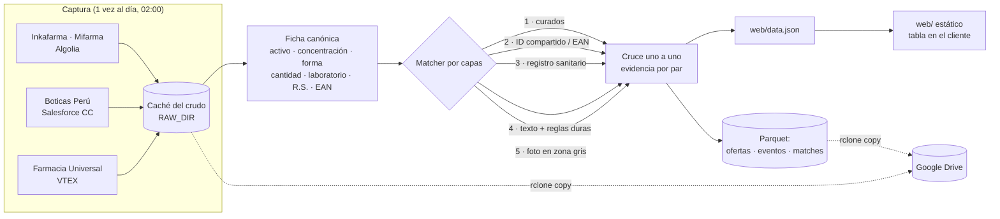
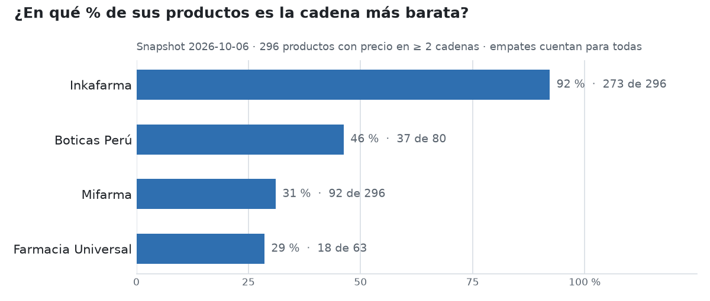

# Radar de Precios · farmacias del Perú

**Español** · [English](README.en.md)


Compara el precio del **mismo medicamento** en cuatro cadenas de farmacias peruanas. Lo difícil
no es leer precios: es decidir, sin un catálogo compartido, que dos listados con nombres
distintos son el mismo producto — y preferir un "—" antes que un cruce equivocado.

**Demo:** [ichisieben.dev/radar-precios](https://ichisieben.dev/radar-precios/)


## Cómo funciona


```mermaid
flowchart LR
  subgraph Captura["Captura (1 vez al día, 02:00)"]
    A1[Inkafarma · Mifarma<br/>Algolia] --> C[(Caché del crudo<br/>RAW_DIR)]
    A2[Boticas Perú<br/>Salesforce CC] --> C
    A3[Farmacia Universal<br/>VTEX] --> C
  end
  C --> F[Ficha canónica<br/>activo · concentración · forma<br/>cantidad · laboratorio · R.S. · EAN]
  F --> M{Matcher por capas}
  M -->|1 · curados| R[Cruce uno a uno<br/>evidencia por par]
  M -->|2 · ID compartido / EAN| R
  M -->|3 · registro sanitario| R
  M -->|4 · texto + reglas duras| R
  M -->|5 · foto en zona gris| R
  R --> J[web/data.json]
  R --> P[(Parquet:<br/>ofertas · eventos · matches)]
  C -. rclone copy .-> D[(Google Drive)]
  P -. rclone copy .-> D
  J --> W[web/ estático<br/>tabla en el cliente]
```

- **Captura cortés:** solo endpoints públicos de catálogo que la propia tienda llama desde el
  navegador; una petición a la vez, 2–6 s entre peticiones al mismo dominio, *back-off*
  exponencial ante 429/503 en las búsquedas, nunca login ni carrito.
- **Primero el caché, después el parseo:** cada respuesta se guarda cruda. Reprocesar una
  corrida no toca la red y da el mismo `data.json` byte a byte.
- **Matcher por capas de costo creciente**, con vetos duros en cada paso (principio activo,
  concentración, cantidad, pediátrico/adulto, laboratorio, guarda de precio > 3×). Detalle en
  [`docs/MATCHING.md`](docs/MATCHING.md).
- **Web sin build:** HTML/CSS/JS plano que lee `data.json` y arma la tabla en el cliente. Rutas
  relativas: funciona igual en `/radar-precios/` que en la raíz. Costo variable: cero.

## Cómo correrlo

Probado en Windows 10 con Python 3.12 (el núcleo `core/` es compatible con 3.9).
`PYTHONIOENCODING=utf-8` es obligatorio en la consola de Windows.

```bash
py -m pip install -r requirements.txt
py -m pip install playwright matplotlib     # solo para el smoke web y la gráfica
py -m playwright install chromium

# Ver el demo con los datos incluidos (sin red ni llaves)
py -m http.server -d web 8000                  # http://localhost:8000  ·  ?demo=1 simula ▲▼ y promos

# Pruebas (sin red)
PYTHONIOENCODING=utf-8 py -m tests.test_matcher_regresion   # 85/85 pares curados
PYTHONIOENCODING=utf-8 py -m tests.test_http_cache
PYTHONIOENCODING=utf-8 py -m tests.test_credencial
PYTHONIOENCODING=utf-8 py -m tests.test_publish
PYTHONIOENCODING=utf-8 py -m tests.test_sincronizar           # requiere rclone instalado
PYTHONIOENCODING=utf-8 py -m tests.test_web_smoke           # demo en subcarpeta, Playwright
```

Para capturar precios de verdad hace falta un `.env` (copiar `.env.example`) con las llaves
Algolia **públicas de solo búsqueda** que Inkafarma y Mifarma publican en su propio JavaScript.
No son secretas, pero rotan: si la búsqueda devuelve 403, se vuelven a copiar desde DevTools →
Network → `*.algolia.net`.

```bash
PYTHONIOENCODING=utf-8 py -m pipeline.run --todo                     # captura + proceso + export (~1 h)
PYTHONIOENCODING=utf-8 py -m pipeline.run --desde-cache <id-corrida>  # reproceso sin red
PYTHONIOENCODING=utf-8 py -m tests.verificar_desde_cache <id-corrida> # sin red y byte a byte
```

La corrida completa no se repitió para escribir este README; sus cifras salen del log de la
corrida nocturna del 2026-10-06 (abajo). El reproceso desde caché sí se corrió el 2026-10-07:
12 s, cero peticiones de red, salida idéntica byte a byte.

## Qué produce (corrida del 2026-10-06)

| Medida | Valor |
|---|---|
| Productos con precio en ≥ 2 cadenas | **296** |
| … con precio en las 4 cadenas | **37** |
| … con precio de Boticas Perú / de Farmacia Universal | 80 / 63 |
| Cruces Boticas/Universal por método | 47 EAN · 19 registro sanitario · 69 texto · 6 curados · 2 foto |
| Peticiones de la corrida · errores | 1 354 · 0 |
| Duración | 58 min (3 464 s) |
| Brecha mediana entre la cadena más cara y la más barata | 3,1 % |
| Productos con brecha ≥ 20 % | 25 |



Ojo al leer la gráfica: la canasta se siembra desde el catálogo de Inkafarma, así que Inkafarma
tiene precio en todos los productos y las demás solo donde hubo cruce. Es una foto de esta
canasta, no un ranking de cadenas.

## Límites honestos

- **Canasta, no catálogo.** 296 productos elegidos por términos y subcategorías, no el catálogo
  completo de cada cadena. La cobertura por categoría completa es la fase F2 del
  [`V2_PLAN.md`](V2_PLAN.md) y está en una rama sin mergear.
- **Un "—" no significa que la cadena no lo venda.** Significa que el matcher no encontró un
  equivalente con evidencia suficiente. Es deliberado: un falso positivo es peor que un hueco.
- **El precio es de la web, no de la tienda física,** y de la hora de la captura (02:00, Lima).
- **Solo medicamentos, suplementos y dermocosmética.** Cosmética y cuidado personal quedan
  fuera: sin principio activo no hay cómo distinguir SKUs casi idénticos.
- **La interfaz nueva (v2) está en revisión.** Astro, bilingüe, con historial por producto,
  panorama y metodología: [PR #4](https://github.com/IchiSieben/farmacias/pull/4). El demo
  publicado es la v1 de esta rama, solo en español.
- **No es una fuente oficial.** La referencia oficial de precios de medicamentos en el Perú es el
  Observatorio Peruano de Productos Farmacéuticos de DIGEMID.

## Datos, marcas y licencias

- **Código:** Apache 2.0 ([`LICENSE`](LICENSE)).
- **Precios:** son hechos públicos leídos de las tiendas en línea de cada cadena y les
  pertenecen. Este es un ejercicio independiente de comparación, **sin afiliación** con
  Inkafarma, Mifarma, Boticas Perú ni Farmacia Universal. Las marcas citadas son de sus dueños.
- **Dependencias:** httpx (BSD-3), PyYAML (MIT), rapidfuzz (MIT), selectolax (MIT),
  ImageHash (BSD-2), Pillow (MIT-CMU), pyarrow (Apache 2.0).

## Más documentación

[`docs/MATCHING.md`](docs/MATCHING.md) cómo se decide un cruce ·
[`docs/ESQUEMA_DATOS.md`](docs/ESQUEMA_DATOS.md) esquema de crudo, Parquet y JSON ·
[`docs/ESTUDIO.md`](docs/ESTUDIO.md) conceptos que enseña el proyecto ·
[`V2_PLAN.md`](V2_PLAN.md) plan vigente · [`ROADMAP.md`](ROADMAP.md) lo que falta, con fecha ·
[`SECURITY.md`](SECURITY.md) cómo reportar un problema.

## Cómo citar

Ver [`CITATION.cff`](CITATION.cff) (GitHub muestra el botón **Cite this repository**).

Yoichi Palacios Tanaka (IchiSieben) · [ichisieben.dev](https://ichisieben.dev)
